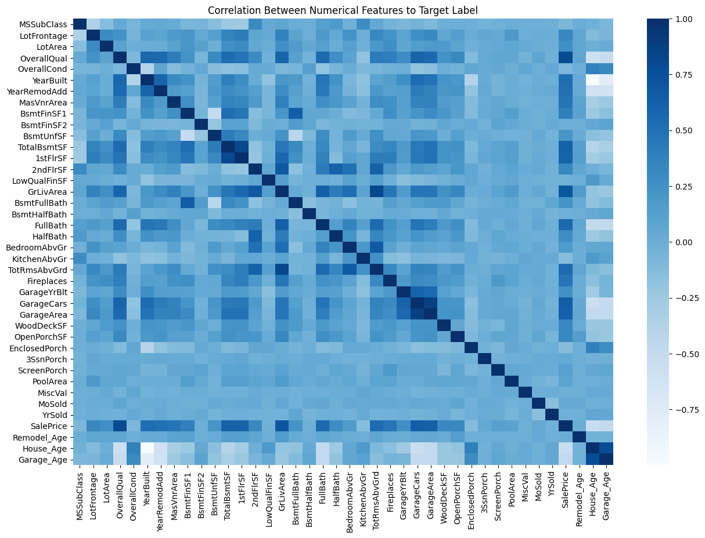
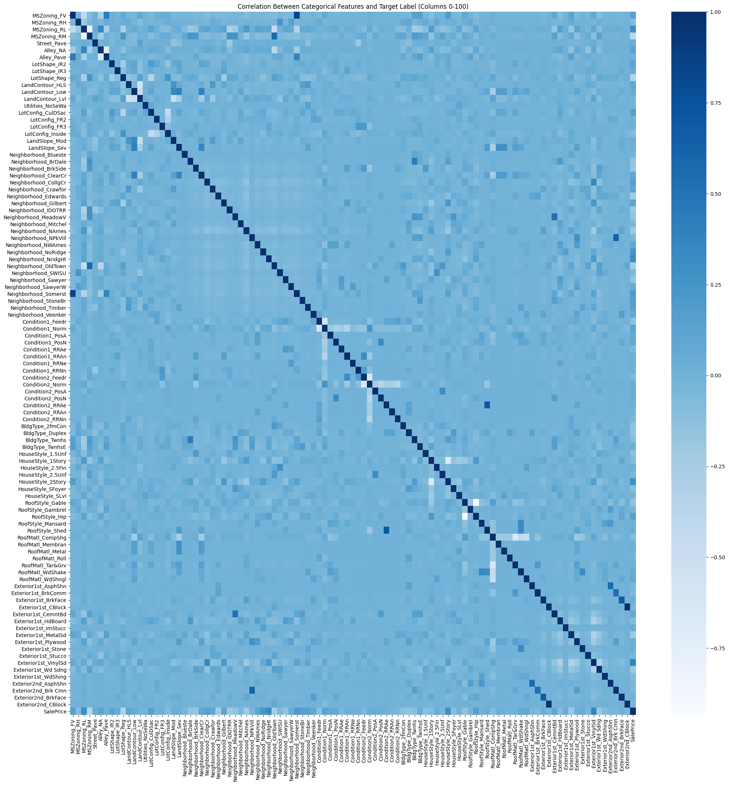

# House-Prices-Kaggle-Competition

Predicting the prices of houses from a data set considering of 80 features and 1460 records

# Competition Results

Using Stacking with a layer of 4 weak learners and a meta model, I stand at the top 18% of the competition

The evaluation metric used was RMSE.

### Solo Model

XGBoost Solo had a RMSE of 0.13578

### Stacking  

I created a Stacking Regressor consisting of XGBoost, Random Forest Regressor, Support Vector Regressior as my first layer of estimators and then feeding those predictions into a Lasso Regression meta model to predict the outcomes on the test data set.

The ensembled model had a RMSE of 0.12129.

#### Improving Stacking Regressor

I decided to add one more model to the first layer of the ensemble model, which was LightGBM. I tuned hyperparmeters using the train data set with CV and a grid search.

The score of the model increased by a small margin, but still an improvement.

The ensembled model had a RMSE of 0.12076.

### Blending - Weighted Averages

I used the same models as I did for the stacking approach.

I ran a grid search of weights 0.1 - 1 to evaluate which weight combination correspended with the best RMSE.

The weights that achieved the best score was:

RFR: 0.1  
XGBoost: 0.7  
SVR: 0.1  
LightGBM 0.1  

On the submission to kaggle, the RMSE was: 0.12811

So overall, not an improvement from stacking, but the score did improve considerably more than just using XGBoost alone.

#### Blending - Weighted Averages Improved

For some reason,  I forgot to include Lasso regression in the original ensemble.

I tuned alpha with a grid search and CV -- alpha is best at 0.01

Then I tuned weights with a grid search  

The weights that achieved the best score was:  

RFR: 0.1  
XGBoost: 0.1  
SVR: 0.6  
LightGBM: 0.1  
Lasso: 0.1  

It is interesting now that aftering adding in Lasso, XGBoost does not have much effect on a result as it did in the last ensemble. Instead it is the case for SVR now.

# EDA
Let's look at the target variable first

It's clear that there is a right skew in the Sales Price. That means a log transformation is needed

That looks a lot better to work with.

# Corollary Features
Since there are 80 features in this data set, some categorical and some numerical, I will first compare the numerical features, then compare the categorical, and then combine the two.

## Numerical Features Matrix

Correlations with Target Label:  
- Really Strong
    - OverallQual
    - GrLivArea (Above Ground Living Area)
    - GarageCars
    - GarageArea
- Strong
    - Year Built
    - YearRemodAdd (Year Remodeled)
    - MasVnrArea
    - TotalBsmtSF
    - 1stFlrSF
    - FullBath
    - TotRmsAbvGrd (Total Rooms Above Ground)
    - Fireplaces
    - GarageYrBlt
- OK
    - LotArea
    - BsmtUnfSF (Unfinished square feet of basement area)
    - 2ndFlrSF
    - BsmtFullBath
    - HalfBath
    - WoodDeckSF
    - OpenPorchSF  

I'll take these features and put them into their own correlation matrix so I can more accurately see their Pearson scores and eliminate more.
  

This is a bit better, but I have some features with p-values close to 0. So I will remove those as well

  
This looks pretty good.  

There are some possibilities of multicollinearity:
- GrLivArea and TotRmsAbvGround
- YearBuilt and GarageYrBlt
- 1stFlrSF and TotalBsmtSF
- GarageArea and GarageCars (Expected) 

In relation to the target label, overall quality seems to be the strongest correlating feature in the data set.

## Correlation Between Categorical Features
Same process as before, except this time I got dummy variables of all the categorical features and used spearman's method instead of pearson.  
Due to the dummies call, the dataframe has 209 columns. So I will do two heat maps, splitting the columns so it is somewhat readable

  

  

I am not going to write out the features that are important yet, too many to go through. Instead I will take all features I currently have and use RFECV and XGBRegression to get feature importance.
